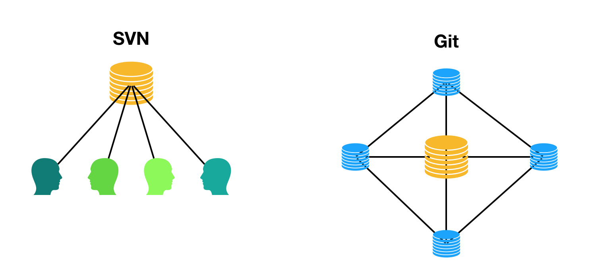

# 对比 SVN

我们公司是从 SVN 迁移过来的，SVN 和 git 之间有什么区别呢？

## 集中式 VS 分布式

这是 Git 和 SVN 最明显的区别之一。SVN 是集中式的， 依赖于一台 SVN 服务器，每一个本地版本库只是一个文件副本，不是一个完整的版本库，如果 SVN 服务器这个节点挂了, 所有子节点都无法工作。而 Git 是分布式， 每一个 clone 的项目都是一个完整的版本库，这些版本库是对等的。然而我们也会使用 Gitlab 这样的，集中
git 服务器， 来进行代码的交换和维护。

## 分支更加轻量

使用 Git 一段时间之后， 会明显感觉到 Git 的分支，不管是创建、合并、删除、切换都非常的快和方便。这得益于 Git 的底层设计，所以在 Git 项目中， 我们可以大胆的使用分支来解决我们的问题。
SVN 的分支则是一个完整的目录拷贝， 切换分支实际上就是切换到其他目录。而 Git 是在同一个工作区中切换.

> 举个例子：SMS 项目需要安装前端依赖，在使用 SVN 时，每次新建一个分支，切换到这个分支开始之前都要重新安装依赖。由于网络原因， 下载依赖可能会很慢。而使用 Git 切换分支则直接在当前的工作区中完成

## 更加快速

得益于 Git 的架构设计， 相比 SVN，Git 的版本库更小，克隆和操作的速度更快。

## 自动化

Git 支持各种客户端和服务端的自动化脚本。比如代码格式化，可以使用客户端的“precommit”钩子，实现在提交前对代码进行格式化。这样可以实现团队的代码规范，如果成员的代码不符合规范，将无法提交到版本库。通过服务端钩子可以实现持续集成， 持续部署等等。

## 更丰富的团队协作方式
