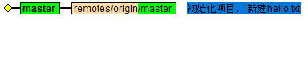
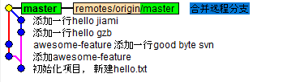

# 集中式工作流

集中式工作流， 或者称为`SVN工作流`, 如果你是从 SVN 迁移过来的，那么你已经熟知集中式工作流了。和 SVN 一样， 集中式工作流以一个`中央仓库`, 所有成员的本地版本库的修改都提交到这个分支。这种工作流的特点有:

* 使用`中央仓库`作为本地版本库同步的唯一入口。
* 只有一个`master`分支


尽管和 SVN 类似，但和 SVN 相比，Git 还有以下优势：

* 每个本地项目都是一个完整的版本库， 有一定的独立性， 不需要依赖于中央仓库, 我们可以自己选择合适的时间点进行同步。而 SVN 可能仅仅是一个目录的副本, 中央仓库挂了，将无法提交
* Git 有更强大的分支和合并模型

## 1. 适用场景

* 如果刚从 SVN 迁移过来，使用集中式工作流，让团队无需去适应一个全新的开发流程；或者可以作为`过渡方案`
* 工作流简单自然。学习成本低，适合小型项目

## 2. 示例

### 2.1 创建中央仓库

我们可以从 `gitlab` 中创建一个项目, 或者直接通过 ssh 登录到服务器进行创建：

```shell
$ ssh user@myhost
# 创建一个裸仓库

# 裸仓库是指没有工作目录的仓库，也就是说只有一个`.git`文件夹。
# 裸仓库一般在服务端使用, 因为我们不会在服务端进行实际的开发
$ git init --bare /path/to/myrepo.git
```


创建完仓库之后, 团队成员就可以将其克隆到本地进行开发：

```shell
$ git clone ssh://user@myhost/path/to/myrepo.git
```


### 2.2 开发和提交

现在就可以在工作区中添加和编辑文件了. 每一个提交都需要经过暂存和提交

```shell
# 新建一个文件
$ echo "hello world" > "hello.txt"

# 添加到索引
$ git add "hello.txt"

# 提交到版本库
$ git commit -m "初始化项目， 新建hello.txt"
```

### 2.3 推送和拉取

到目前为止，变更还在本地版本库，我们需要通过 `push` 命令，将变更推送到远程版本库:


```shell
# 查看远程版本库
# 在git clone一个远程版本库时，git已经将远程版本库设置好了，默认命名为origin
$ git remote
origin


# 目前远程分支为空
$ git remote show origin
* remote origin
  Fetch URL: ssh://user@myhost/path/to/myrepo.git
  Push  URL: ssh://user@myhost/path/to/myrepo.git
  HEAD branch: (unknown)
  Local branch configured for 'git pull':
    master merges with remote master

# 推送到远程版本库的master分支
$ git push origin master
```

目前的分支状态， 可以看到 master 和远程分支都指向了同一个提交对象：


现在，其他成员也要将你的提交拉取下来, 拉取使用`pull`命令


```shell
(Jim)$ git pull origin master
```

### 2.4 冲突解决

假设你和另外一个同事 Jim 正在同时开发这个项目. 你修改了多次 hello.txt, 提交了多次代码到远程库，而 Jim 在创建另一个文件开发完新功能准备提交. 现在的提交图为：


```shell
# Jim很有成就感地准备提交到远程版本库
(Jim)$ git push origin master
error: failed to push some refs to '/path/to/myrepo.git'
hint: Updates were rejected because the tip of your current branch is behind
hint: its remote counterpart. Merge the remote changes (e.g. 'git pull')
hint: before pushing again.
hint: See the 'Note about fast-forwards' in 'git push --help' for details
```

什么鬼。远程版本库拒绝了，原因根据上图可以得知，因为远程版本库比 Jim 的本地版本库的提交记录要新。以前我们使用 SVN，在提交之前我们都习惯"`svn update`"一下， 保证版本库处于最新的状态，并在本地解决好冲突再提交。
git 也是如此。Git 推荐在提交前使用`git pull`拉取最新的版本库。

> 你也可以将远程版本库和你的版本库视作两个独立分支， 那么`git pull`和`git push`的过程就是分支合并的过程. 实际上也是如此. 关于分支合并的细节，见[分支操作](operation.md)一节

```shell
# 拉取最新远程分支, 合并之后会生成一条新的“合并提交”记录
(Jim)$ git pull
(Jim)$ git status
TODO: 添加结果

(Jim)$ git commit -m "合并远程分支"
# 如果有冲突，修复了冲突之后就可以重新提交了
(Jim)$ git push
```

现在的提交图为：


