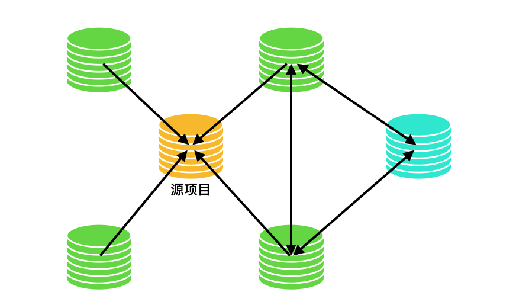

# Fork 工作流

`Fork 工作流`是一种`分布式工作流`，充分利用了 Git 在分支和克隆上的优势。可以安全可靠地管理大团队的开发者，并能接受不信任贡献者的提交。像`github`和`gitlab` 线上服务就是使用这个工作流模式

每个成员都可以 fork 项目到自己的目录, 甚至还可以继续衍生出更多项目, 项目之间的通过 pull request 进行代码合并.
一个项目可以有多个`上游项目`, 也可以由于多个`下游项目`, 它们指向形成一种`图`关系.

## 1. Fork 的原理

Fork 其实不是一个新东西, 当我们在`github`上点击`fork`的时候, `github`只是将项目克隆(git clone)到你的个人目录

## 2. 适用场景

* 适合开源项目. 开源项目需要接受任何开发者的代码共享, 无需给他们正式的代码库的写权限
* 适合大型的, 自发性的团队. fork 工作流可以提供灵活的方式来安全协作

## 3. 工作方式

1. fork: 一般通过服务器页面进行 fork, 创建一个拥有所有权的拷贝
2. 克隆项目到本地, 新建`功能分支`, 提交自己的代码, 然后推送到远程版本库
3. 现在可以发起将`功能分支` 合并到上游(upstream)项目的`Pull Request`请求;
4. 上游项目的所有者决定是否合并你的代码

## 4. 示例
